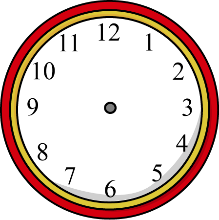

# Simple JS Clock

It is a fun project which displays Current Time as Analog, Digital and other watch faces.

I just developed it for fun when I was getting bored :).

# How to Use it?

Just Clone the Code and Open `index.html` in your browser which supports `HTML5` with `CSS3` and `JavaScript` enabled!

# Images

  
    
    
    
    
    
    
    
      

# Customization

You can customize the clock face by adding image from your computer as well

# Future Scope

As this is just developed in spare time as fun project, there is lot of scope for code optimization and cleaning. I want to develop it further and export this as a library to other devs which can simply plug and play with it in their webpages.

# Licensing and Costing

Free for everyone! 
